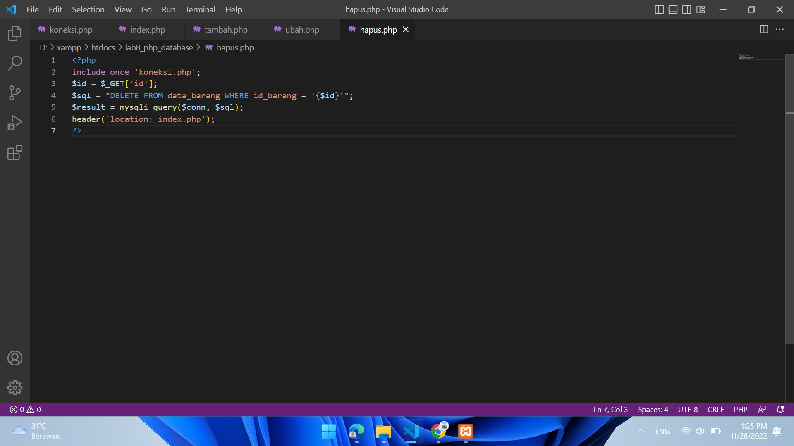

# Lab8Web
## Ananda Fachri Reynaldi
## 312110248
## TI.21.B1
<br>
<b>XAMPP dan phpMyAdmin</b>

Buka XAMPP Control Lalu Klik `Start` untuk menjalankan MySQL Server. Pastikan web server Apache dan MySQL Server sudah dijalankan.
<br>

Setelah itu uji coba gunakan URL :
```
http://localhost/phpmyadmin/
```
<br>

Membuat Database `latihan1`
<br>

Membuat Table `data_barang`
<br>

Menambahkan Data
<br>

Lalu Klik `Kirim`
<br>

<b>Membuat Program CRUD (Create, Read, Update, Delete)</b>

Membuat Folder lab8_php_database pada root directory web server (d:\xampp\htdocs)
<br>

Setelah itu uji coba gunakan URL :
```
http://localhost/lab8_php_database/
```
<br>

Membuat file koneksi untuk menguji koneksi database lalu tampilkan "Koneksi berhasil" dengan perintah `Echo`
<br>

Membuat file index untuk menampilkan data (Read)
<br>

Membuat file baru untuk Menambah Data Barang (Create)
<br>

Mencoba untuk Menambahkan Data Barang
<br>

Hasilnya :
<br>

Membuat file baru untuk Mengubah Data Barang (Update)
<br>

Mencoba untuk Mengubah Data Barang dari 5 menjadi 13
<br>

Hasilnya :
<br>

Membuat file baru untuk Menghapus Data Barang (Delete)
<br>

Mencoba Hapus Data Laptop MSI MODERN 14<br>
<br>

Hasilnya :
<br>